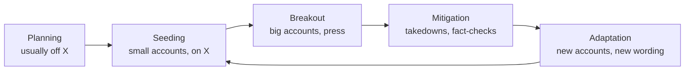

# Pushed or Organic? Research Review

Research review, 22 Sep 2026. Snapshot of the shared doc at <https://claude.ai/code/artifact/837531fc-e0b0-4820-a245-391d9b6e31f8> (rev 14); edits made there are not synced here.

This problem has been studied for over 15 years, usually under the names *coordinated inauthentic behaviour* or *astroturfing*. The reliable tell is rarely any one post. It is a group of accounts doing the same thing at the same moment, again and again. The methods that hold up on proven campaigns are simple. The hard parts are getting enough data, comparing against a baseline, and not accusing real people.

- **Posting in sync is the strongest single tell.** Across 33 state-backed campaigns, 74% of campaign accounts on average posted the same text, or reposted the same post, within one minute of another account. Only about 1% of ordinary users did ([Schoch et al. 2022](https://www.nature.com/articles/s41598-022-08404-9)).
- **Shared links beat shared wording.** On labelled campaigns, accounts sharing the same URLs was the best single signal. Similarity of meaning, measured with embeddings, was near chance on its own ([Luceri et al. 2024](https://arxiv.org/abs/2310.09884)).
- **A spike's shape shows whether there was an outside shock, not who caused it.** Paid and organic trends had similar volume curves ([Varol et al. 2017](https://doi.org/10.1140/epjds/s13688-017-0111-y)). The difference is in the first minutes and in who posted.
- **Talking points show up as a share of repeated text.** In India's 2019 election, every hashtag push organised through WhatsApp groups had over 20% repeated content. Ordinary comparison hashtags had almost none ([Jakesch et al. 2021](https://arxiv.org/abs/2104.13259)).
- **The earliest post we can see is rarely the true origin.** Planning and seeding often happen off X. X search also hides duplicate posts and suspended accounts.
- **Coordination does not prove fakery.** Fans, activists and outlets with one owner all coordinate in the open. Bot scores and AI-text detectors are unreliable, so they are not evidence.
- **AI paraphrasing defeats copy-matching, but behaviour still gives campaigns away.** AI-written campaigns are still caught through timing, reply targets, shared links and account traits ([Alethea 2025](https://alethea.com/insights/promptpasta); [Pote et al. 2025](https://ojs.aaai.org/index.php/ICWSM/article/view/35889)).

## The problem, stated precisely

"Was this pushed?" is really three questions, and each needs different evidence. Post data can answer the first well, the third partly, and the second almost never.

1. **Is there coordination?** Are accounts acting together more often than chance allows? This is visible in posts: timing, wording, links, reply targets.
2. **Is it hidden or fake?** Is there a concealed sponsor, fake personas, or undisclosed payment? In practice this was proven by leaks, court records, regulator findings or platform takedowns, not by the posts.
3. **Where did it start?** Nimmo's [Breakout Scale](https://www.brookings.edu/wp-content/uploads/2020/09/Nimmo_influence_operations_PDF.pdf) separates two things:
   - the *insertion point*, where the operator planted the idea;
   - the *breakout moments*, when real users carried it into new communities, platforms or the press.

The ABC framework ([François 2019](https://cdn.annenbergpublicpolicycenter.org/wp-content/uploads/2020/05/ABC_Framework_TWG_Francois_Sept_2019.pdf)) makes the same split. It separates manipulative **A**ctors, deceptive **B**ehaviour and harmful **C**ontent, and recommends judging behaviour, not content. Platforms define coordinated inauthentic behaviour this way.

That leaves four situations to tell apart, not two:

| Situation | Coordinated? | Hidden? | Example |
| --- | --- | --- | --- |
| Organic reaction | No, but everyone saw the same trigger | No | Gas prices rising |
| Open organising | Yes | No | Activist hashtag day, fandom streaming push, your AI group announcing an event |
| Astroturf | Yes | Yes | South Korean intelligence service (NIS) election posts, scripted paid influencers |
| Seeded, then picked up | At the start | The seed | Operations seed a frame and sincere users adopt it ([Starbird et al. 2019](https://par.nsf.gov/biblio/10170688)) |

The last row is the "talking points, then trend-hoppers" pattern from the conversation. Research treats it as the normal case: most influence operations are collaborations with sincere users. So any detector will also flag genuine people who joined in later.

## Approach 1: coordination networks

The standard method links accounts that leave the same trace within a short window, then examines the dense clusters. Almost every paper since [Pacheco et al. 2021](https://arxiv.org/abs/2001.05658) follows four steps:

1. Pick a trace: the same text, the same repost, the same link, the same hashtag sequence, or replies to the same post.
2. Link two accounts each time they share that trace, optionally within a time window.
3. Drop weak links, for example by weighting (reposting a mega-viral post counts for little), keeping only the strongest links, or a statistical filter.
4. Have a person inspect the clusters that remain.

How each trace performed on labelled campaigns (AUC: 0.5 is chance, 1.0 is perfect):

| Trace | Window used | Result | Source |
| --- | --- | --- | --- |
| Same link (co-URL) | Seconds (set from the data) to 5 min | AUC 0.72, best single trace | [Giglietto 2020](https://doi.org/10.1080/1369118X.2020.1739732); [Luceri 2024](https://arxiv.org/abs/2310.09884) |
| Same repost (co-retweet) | 1 min with 10+ repeats, or untimed | AUC 0.69 | [Schoch 2022](https://www.nature.com/articles/s41598-022-08404-9); [Nizzoli 2021](https://arxiv.org/abs/2008.08370) |
| Same hashtag sequence | Per day, 5+ hashtags | AUC 0.68 | [Pacheco 2021](https://arxiv.org/abs/2001.05658) |
| Fast repost | Within 10 s of the original | AUC 0.62 | Luceri 2024 |
| Similar meaning (embeddings) | Cosine similarity ≥ 0.7 | AUC about 0.5 on its own | Luceri 2024 |
| Identical text (co-tweet) | 1 min | 74% of campaign accounts vs about 1% of ordinary users | [Keller 2020](https://doi.org/10.1080/10584609.2019.1661888); Schoch 2022 |
| Five or more replies under one post | Minutes to hours | AUC 0.88 to 0.97, led by similar reply text | [Pote 2025](https://ojs.aaai.org/index.php/ICWSM/article/view/35889) |
| First five traces combined | Mixed | AUC about 0.84, no training labels | Luceri 2024 |

**Why it works.** [Keller et al.](https://doi.org/10.1080/10584609.2019.1661888) studied the South Korean intelligence service's election campaign, with account lists from court records. Their explanation: paid operators cut corners, so they reuse text, act together and work office hours. They found about 153,000 account pairs posting the same text within a minute of each other, against none among comparable ordinary users. Few of the accounts were bots.

**The time window decides what you can see.** A 2026 preprint compared windows from 10 seconds to 1 day on 14 labelled campaigns ([Panayiotou et al.](https://arxiv.org/abs/2609.21959)).

- Short windows were precise for some campaigns and blind to others.
- Long windows pulled in ordinary users sharing popular content.
- Schoch found the campaign-versus-baseline gap held from 1 minute up to about 8 hours.

The practical answer is to report several windows side by side.

**Baselines are what make a number mean something.**

- Schoch compared each campaign with random users matched on activity, and with users of the same hashtags.
- CooRnet sets its window from the data itself, so it flags sharing that is faster than usual for that dataset.
- [Caldarelli et al. 2020](https://www.nature.com/articles/s42005-020-0340-4) use a statistical null model that discounts very active users and very viral posts.

No paper offers a tested baseline for "everyone reacting to the same news". The partial defences:

- tight windows, because organic reactions spread over minutes to hours, not seconds;
- down-weighting viral items;
- requiring the same account pair to match on several *different* items.

**What fits our data.**

- **Feasible:** identical text, shared links, hashtag sequences, reply bursts, and untimed co-reposting from reposter lists.
- **Not feasible:** timed co-reposting, because X does not show when a repost happened. Also full-timeline methods such as [Digital DNA](https://arxiv.org/abs/1703.04482), which need each account's complete history.
- **Untested:** no paper uses data sampled the way ours is, a person scrolling plus searches.

## Approach 2: timing and the shape of a spike

The shape of a spike shows whether an outside shock happened. It cannot say whether that shock was news or a planted push. That takes minute-level detail and a look at who posted.

Daily volume curves fall into a few classes ([Lehmann et al. 2012](https://arxiv.org/abs/1111.1896); [Crane & Sornette 2008](https://www.pnas.org/doi/10.1073/pnas.0803685105)):

| Shape around the peak | Usual cause | Example hashtag |
| --- | --- | --- |
| Little build-up, most volume after, fast decay | Unexpected outside event | #winnenden (a school shooting) |
| Most volume before the peak | Scheduled event | #masters |
| Roughly symmetric, more reposts | Word of mouth | #watchmen |
| Nearly all volume on the peak day | One-off moment | #nsotu |

Lehmann's recipe needs only daily counts, which makes it the most transferable:

- a peak is a day with at least 10× the median of the surrounding 61 days;
- each peak is described by its share of volume before, on and after the peak day, within ±7 days.

A planted push is also an outside shock, so shape alone cannot separate it from news. [Varol et al. 2017](https://doi.org/10.1140/epjds/s13688-017-0111-y) compared 75 paid trends with 852 organic ones, and their volume curves looked alike. Their classifier reached about 95% AUC after a topic trended but only 70 to 75% before. Before trending, account features mattered most.

**What gives a planted push away is the first minutes.**

- **India, 2019.** [Jakesch et al.](https://arxiv.org/abs/2104.13259) joined about 600 party WhatsApp groups. Organisers posted a hashtag, a start time and a Google Doc of ready-made tweets. In one campaign, 68 users posted almost 500 template tweets in the first 5 minutes after a 9 am start. 69 of 75 campaigns reached national trends.
- **Turkey, 2015 to 2019.** [Elmas et al.](https://arxiv.org/abs/1910.07783) found over 19,000 fake trends pushed by more than 108,000 accounts. The accounts posted filler text together, then deleted it. Anyone seeing only the posts that survived saw a trend with no visible cause.
- **South Korea, 2012.** Over 85% of identical-text pairs were posted within a minute, often in the same second, in weekday office hours ([Keller et al.](https://doi.org/10.1080/10584609.2019.1661888)).
- **US midterms, 2010.** [Ratkiewicz et al.](https://ojs.aaai.org/index.php/ICWSM/article/view/14127) found a few accounts producing most of a topic's volume. In one example, nine accounts sent 929 tweets in 138 minutes, mentioning real users so they would pass the link on.

**Resolution needed.** Classifying the shape needs daily counts for ±7 days, plus about 30 days of baseline. Seeing an injection needs 1- to 15-minute bins in the hours before the peak. [Kleinberg's burst detection](https://www.cs.cornell.edu/home/kleinber/bhs.pdf) can run on a topic's *share* of all captured posts per bin. Using the share corrects for how much someone happened to scroll that day.

**Google Trends is a fair way to date when the public noticed, and a weak way to find an onset.**

- It measures searching, not posting.
- Values are rescaled so the window's peak is 100, so an early rise rounds to 0 or 1.
- Hourly data exists only for windows of 7 days or less.
- Niche frames fall below its volume threshold.
- A push can trend on X without ever moving search interest (Keller; Elmas).

## Approach 3: copies, talking points and frames

Detecting copied wording is mature and precise. Clustering by meaning finds "same idea, different words", but cannot by itself tell a script from people converging on their own. Text methods come in three layers:

| Layer | Main methods | Catches | Misses |
| --- | --- | --- | --- |
| Copies | Word shingles with MinHash ([Broder 1997](https://www.semanticscholar.org/paper/On-the-resemblance-and-containment-of-documents-Broder/8addb1718c2bc6bbb0d82cd1a57b41198bf65965)); alignment to show the shared span ([Wilkerson et al. 2015](https://onlinelibrary.wiley.com/doi/abs/10.1111/ajps.12175)) | Copy-paste and light edits | AI paraphrase |
| New phrases and stories | First-story detection ([Petrović et al. 2010](https://aclanthology.org/N10-1021/)); phrase families ([MemeTracker 2009](https://www.cs.cornell.edu/home/kleinber/kdd09-quotes.pdf)); bursts of distinctive words | A new phrase or story appearing | A frame with no fixed wording |
| Frames and narratives | Embeddings with incremental clustering ([Hanley & Durumeric 2024](https://arxiv.org/abs/2308.02068)); hero, villain and victim roles | Same idea in different words | Whether it was coordinated |

**Lessons from copy detection.**

- **Common phrases cause false matches.** In a study of news reuse, every 7-word phrase used 100+ times turned out to be incidental: stock phrases, names or scraping debris ([Nicholls 2019](https://ijoc.org/index.php/ijoc/article/view/9904)). Wilkerson treated any passage repeated across 50+ documents as boilerplate.
- **A missing source creates a false origin.** When the true source (say, a press release) is not in the data, the first outlet to use its text gets wrongly credited as the originator (Nicholls).
- **Count authors, not posts.** Petrović found unique users per thread identified real events better than post counts. Threads with low word variety (entropy below 3.5) were mostly spam.
- **Concentration is a tell.** MemeTracker dropped phrases where 25% or more of uses came from one source, because those were spam. The same rule works as a "pushed" flag.

**Frames need a definition before they can be measured.**

- [Entman 1993](https://academic.oup.com/joc/article-abstract/43/4/51/4160153): a frame picks a problem, a cause (someone to blame), a moral judgement and a remedy. It also works through what it leaves out.
- General frame lists such as the 15 in the [Media Frames Corpus](https://aclanthology.org/P15-2072/) are too coarse for a question like "who gets blamed for gas prices". Issue-specific frames reveal differences that general ones hide ([Mendelsohn et al. 2021](https://aclanthology.org/2021.naacl-main.179/)). In practice, that means the researcher defines the frames.
- The closest formal version of "a new blame target" is tracking which person or group sits in the villain role over time ([Frermann et al. 2023](https://aclanthology.org/2023.acl-long.486/); [SemEval-2025 Task 10](https://aclanthology.org/2025.semeval-1.331/)). The strong systems use large language models.
- An omission can only be measured against a reference set of frames someone has defined.

**The best blueprint for tracking narratives is Hanley & Durumeric's "Specious Sites".**

- **Clustering:** they embedded 100-word passages from 1,334 news sites. Passages within cosine 0.60 counted as the same narrative, about 96% precise on their model. Clusters were updated daily.
- **Roles:** a site is an *originator* if it published on a narrative's first day. It is an *amplifier* if it published before the peak and within the first 15% of volume.
- **Calibration:** their thresholds belong to their fine-tuned model and must be recalibrated for any other model.

**Discipline leaves a statistical trace.** [Gentzkow et al. 2019](https://onlinelibrary.wiley.com/doi/abs/10.3982/ECTA16566) measured partisanship by how well a phrase predicts the speaker's party. Message discipline shows up as phrases concentrated in one group. Our distinctive-words code already measures the same kind of concentration.

## Cascades and origins

With only captured posts, "who got it from whom" can be traced along explicit quotes, replies and mentions, and no further. The research also shows why the earliest post we hold is a poor guess at the source.

That is [Donovan's Media Manipulation Life Cycle](https://mediamanipulation.org/methods/), simplified. Our capture sees stage 2 onward, so the "origin" we find is usually a seeding post. Ryan Holiday's ["trading up the chain"](https://en.wikipedia.org/wiki/Trust_Me,_I'm_Lying) describes the same path: plant a story with a low-standards outlet, then let bigger outlets cite it.

**What cascade research tells us.**

- **Most big spreads are broadcasts.** [Goel et al. 2016](https://doi.org/10.1287/mnsc.2015.2158) measured how many generations deep a spread goes. Even the largest cascades were mostly one big account's audience reposting. Size and depth were barely correlated.
- **Count independent starts.** [Vosoughi et al. 2018](https://doi.org/10.1126/science.aap9559) treat a rumour tweeted separately by 10 people as 10 cascades. Many separate starts in a tight window, none quoting another, is the footprint of seeding.
- **Compare like with like.** Differences between cascades largely vanish once you compare cascades of equal size ([Juul & Ugander 2021](https://www.pnas.org/doi/10.1073/pnas.2100786118)).
- **What deliberate seeding looks like.** Marketing field experiments found seeding well-connected accounts beat random seeding by 39 to 52%, and doubled results in a live campaign ([Hinz et al. 2011](https://doi.org/10.1509/jm.10.0088)). The resulting footprint: several prominent accounts posting close together, not linked to one another, with similar framing.

**Why the earliest post is not the source.**

- **Inference is weak even with perfect data.** With the full follower graph and a single true source, the best method names the right account only about a quarter of the time on simple networks ([Shah & Zaman 2011](https://arxiv.org/abs/0909.4370)).
- **The first copy may be the victim.** In one Russian operation, the fake accounts copied real US activists' posts. The earliest instance belonged to the genuine activist ([Graphika, IRACopyPasta](https://www.graphika.com/reports/copypasta)).
- **Ideas often start off X.** Two fringe communities, the /pol/ board on 4chan and Reddit's r/The\_Donald, produced about 6% of mainstream-news links and over 4.5% of alternative-news links that reached Twitter ([Zannettou et al. 2017](https://arxiv.org/abs/1705.06947)). They also produced many of the memes that later spread elsewhere ([Zannettou et al. 2018](https://arxiv.org/abs/1805.12512)). Seen from X alone, all of that shows up as unexplained background.

**Useful clues to an off-X start.**

- The link domains in the earliest captured posts.
- Screenshots of other platforms.
- Identical images. Matching images would mean storing an image fingerprint, which we don't do today.

Methods that infer hidden spread networks from timing alone ([NetInf](https://arxiv.org/abs/1006.0234), [SEISMIC](https://arxiv.org/abs/1506.02594)) need dense repost timings or follower counts that we don't capture.

## Known pushed campaigns

In nearly every proven case, the proof came from outside the posts: a leak, a court record, a regulator or a platform takedown. The posts then showed a signature that could be checked. The one signature present in most text-visible cases is the same or near-same wording from different accounts in a short window.

| Year | Case | How it was proven | Signature on the platform | Visible in our capture? |
| --- | --- | --- | --- | --- |
| 2025 | [Pro-soda posts on food-stamp (SNAP) limits](https://www.leefang.com/p/sugary-soda-industrys-covert-influencer) | Leaked brief, screenshots, one influencer's admission; client unconfirmed | Near-identical wording from several large accounts within about 48 hours, then deletions | Yes |
| 2025 | Cracker Barrel logo and American Eagle backlash ([PeakMetrics](https://www.peakmetrics.com/insights/ai-bots-cracker-barrel), [Cyabra](https://cyabra.com/blog/21-fake-profiles-engineered-cracker-barrels-10-5-million-logo-crisis/)) | Vendor reports only, not proven | About 70% of boycott posts used identical phrasing; "% fake" claims with no method or baseline | Phrasing share only |
| 2024 | [STOIC, funded by Israel's diaspora ministry](https://dfrlab.org/2024/02/14/suspicious-accounts-on-x-amplify-allegations-against-unrwa/) | DFRLab on X; Meta and OpenAI takedowns | 111 of 114 accounts created on two days; identical replies to different politicians within a minute | Yes, except creation dates |
| 2023–24 | [Tenet Media, funded by RT](https://www.justice.gov/archives/opa/pr/two-rt-employees-indicted-covertly-funding-and-directing-us-company-published-thousands) | US indictment, money trail | None: output looked like the hosts' normal content | No |
| 2022–24 | [Doppelganger](https://dfrlab.org/2024/06/03/doppelganger-targets-us-audience-on-x-to-discredit-georgian-protests/) (Russia) | Internal documents in a [DOJ affidavit](https://www.justice.gov/d9/2024-09/doppelganger_affidavit_9.4.24.pdf) | Reply quotas under big accounts; random word-pair handles; replies minutes apart; redirect links | Yes |
| 2019– | [Spamouflage](https://www.graphika.com/reports/spamouflage-breakout) (China) | Takedowns and investigator reports | Repeated text; shift-work rhythm with meal breaks; engagement mostly from its own accounts | Mostly |
| 2019 | [BJP "trend alerts"](https://arxiv.org/abs/2104.13259) (India) | Researchers inside about 600 WhatsApp groups | Burst at the announced time; over 20% repeated text in every campaign | Yes: the best test case |
| 2018 | [Sinclair "must-run" script](https://www.npr.org/sections/thetwo-way/2018/04/02/598794433/video-reveals-power-of-sinclair-as-local-news-anchors-recite-script-in-unison) | Deadspin montage; Sinclair confirmed | One script read word for word by dozens of anchors | Partly |
| 2016 | [Lord & Taylor dress](https://www.ftc.gov/business-guidance/blog/2016/03/ftcs-lord-taylor-case-native-advertising-clear-disclosure-always-style); [Fyre Festival](https://www.forbes.com/sites/lisettevoytko/2020/05/20/kendall-jenner-settles-fyre-festival-instagram-post-lawsuit-for-90000/) | FTC settlement; bankruptcy settlement | Many paid influencers posting the same item or image in one window, undisclosed | Timing yes; same image needs image matching |
| 2014–18 | [Russia's Internet Research Agency](https://www.tandfonline.com/doi/abs/10.1080/10584609.2020.1718257) | Twitter's handle list to Congress; Mueller indictment | Specialised personas; real reach came when celebrities and outlets quoted them | Partly |
| 2013–14 | [China's "50 Cent" posts](https://gking.harvard.edu/50c/) | Leaked propaganda-office emails | Bursts of cheerleading timed to sensitive events, changing the subject rather than arguing | Partly |
| 2012 | [South Korean intelligence service](https://doi.org/10.1080/10584609.2019.1661888) | Court records | Identical text within a minute; weekday office hours | Yes |

**Test cases we could use.**

- **Historical, with labels.** The [Clemson/FiveThirtyEight IRA dataset](https://github.com/fivethirtyeight/russian-troll-tweets) is freely downloadable: 2.97 million tweets from 2,848 handles. Its fields map onto ours, so we can import it as a fake capture. Twitter's official archive of takedowns no longer loads. A mirror is reported on the [Internet Archive](https://archive.org/details/X_Twitter_Information_Operations).
- **Live, with known ground truth.** Your AI group announcing an event is a clean positive case. Record who is in it and when the message goes out. Asking half to paste and half to reword tests how paraphrase affects detection.
- **Synthetic.** A BJP-style burst: a start time, template text and 50+ accounts. Fixtures built from DFRLab's published STOIC and Doppelganger numbers.
- **Negative controls.** Gas prices, a sports result, a fandom push, and news headlines being shared.

Paid-influencer programmes proven only by money trails (Tenet Media, the 2025 "Chorus" creator programme reported by Wired) left no detectable post signature. Some pushes are invisible to any post-based tool.

## What AI language models changed

AI paraphrasing broke detection by copied wording, but not detection by behaviour. Every AI-driven campaign documented so far was caught through timing, links, reply targets or account traits.

- **Wording no longer overlaps.** A 2026 preprint compared coordinated posting on X in the 2016 and 2024 US elections ([Cho & Yoon](https://arxiv.org/abs/2605.13785)). The share of original posts rose from 59% to 93%. Average word overlap fell from 0.99 to 0.27.
- **The "fox8" botnet of 1,140 accounts** was found through a leaked ChatGPT refusal phrase. It was confirmed through shared links to three sites and the accounts replying to each other. AI-text detectors and Botometer both missed it ([Yang & Menczer](https://arxiv.org/abs/2307.16336)).
- **Alethea's "PromptPasta" (Aug 2025)** found 400+ X accounts posting AI-varied replies under large accounts, typically 5 to 15 minutes after the target post ([report](https://alethea.com/insights/promptpasta)). Telltale traits:
  - no links;
  - recurring adjective pairs;
  - posting in business hours;
  - accounts created in batches;
  - reused avatars.
- **Coordinated reply attacks** mean 5 or more campaign replies under one post, aimed at journalists and officials, with a median delay of about 3 hours. Similar reply text was the strongest feature, even with some paraphrase ([Pote et al. 2025](https://ojs.aaai.org/index.php/ICWSM/article/view/35889)).
- **Platform threat reports.**
  - In [OpenAI's May 2024 report](https://openai.com/index/disrupting-deceptive-uses-of-ai-by-covert-influence-operations/), none of five operations got past level 2 of the Breakout Scale.
  - In a [June 2025 report](https://openai.com/global-affairs/disrupting-malicious-uses-of-ai-june-2025/), "Sneer Review" wrote both posts and replies to fake a debate, then wrote an article claiming a backlash.
  - [Meta's Q1 2024 report](https://transparency.meta.com/sr/Q1-2024-Adversarial-threat-report) says its behaviour-based detection still works.

**AI-text detectors are not usable evidence.**

- **Weak even on long text.** OpenAI withdrew its own classifier after it caught 26% of AI text and wrongly flagged 9% of human text ([OpenAI](https://openai.com/index/new-ai-classifier-for-indicating-ai-written-text/)).
- **Biased against some writers.** Seven detectors flagged on average 61% of essays by non-native English writers as AI-written ([Liang et al. 2023](<https://www.cell.com/patterns/fulltext/S2666-3899(23)00130-7>)).
- **Easy to evade.** Paraphrasing cut one detector's hit rate from 70.3% to 4.6% ([Krishna et al. 2023](https://arxiv.org/abs/2303.13408)).
- **Humans paste chatbot output too.** In a sample of accounts posting "as an AI language model", 76% looked like people pasting ChatGPT text, not bots (Yang & Menczer).

The implication: design for paraphrase from day one. Replies, timing, shared links and reply targets carry the load; wording similarity is supporting evidence.

## False positives, bot scores and ethics

Every paper warns that coordination is not the same as fakery. The costliest mistake in this field has been labelling real people as bots.

**Legitimate activity that looks coordinated:**

- **Activists.** Pension and loan-charge campaigners were among the most coordinated groups in the 2019 UK election ([Nizzoli et al.](https://arxiv.org/abs/2008.08370)).
- **Fans.** About half the retweet coordination around the 2022 US midterms was entertainment and music-award promotion ([Axelrod & Paolillo 2025](https://arxiv.org/abs/2501.11165)).
- **Outlets with one owner, and news share buttons.** These post identical text within seconds (Giglietto; Pacheco).
- **Topic hashtags and generic phrases.** In a 2026 preprint, greetings and vague praise made up 39% of the duplicate clusters found by meaning, against 4.5% of those found by exact wording ([Shafin & Ahmed](https://arxiv.org/abs/2609.13671)).

The reassuring counter-example: a real German vaccination hashtag campaign coordinated in the open, yet looked like ordinary users on the one-minute test ([Schoch et al.](https://www.nature.com/articles/s41598-022-08404-9)).

**Bot scores do not help.**

- **Coordinated accounts are mostly human.** Most astroturf accounts are run by people (Keller). Coordination and automation are unrelated measures (Nizzoli).
- **The scores are unstable.** Botometer's scores and thresholds drift, producing many false positives and false negatives ([Rauchfleisch & Kaiser 2020](https://doi.org/10.1371/journal.pone.0241045)).
- **The benchmarks mislead.** Simple decision trees match top bot detectors on the standard benchmarks, which shows how shallow those benchmarks are ([Hays et al. 2023](https://arxiv.org/abs/2301.07015)).
- **The main tool is frozen.** Botometer X now only serves scores computed before June 2023.

**Vendor percentages are not evidence without a method.** For example, "21% fake profiles" or "44.5% likely bots" in the 2025 brand backlashes came with no disclosed method or baseline.

**A cautionary example.** Emails later released by Twitter indicate its staff concluded most accounts on the "Hamilton 68" Russian-influence list were ordinary users ([Reason](https://reason.com/2023/01/27/twitter-files-matt-taibbi-hamilton-68-russian-bots-fake/)). The list's authors dispute that account.

**Ethics and legal exposure.**

- **Research ethics.** The [AoIR ethics guidelines](https://aoir.org/reports/ethics3.pdf) ask researchers to weigh harm to identifiable people.
- **Legal risk.** Publicly calling a real account fake or paid risks defamation claims. Researchers in this field have faced lawsuits and congressional pressure; the [Stanford Internet Observatory](https://en.wikipedia.org/wiki/Stanford_Internet_Observatory) wound down in 2024 amid both.
- **How to phrase findings.** The safe vocabulary is *coordination evidence* and *earliest captured*, never *bot*, *paid* or *origin*.

## Data access and existing tools (September 2026)

Two facts change the practical picture. X's API is now pay-per-use, so a volume curve for a phrase costs cents. And X's search hides copy-paste posts from the Top tab, so any sweep must use Latest.

**X's official API.** X has charged per use since 6 Feb 2026; the old Basic and Pro plans were moved over during 2026 ([announcement](https://devcommunity.x.com/t/announcing-the-launch-of-x-api-pay-per-use-pricing/256476); [pricing](https://docs.x.com/x-api/getting-started/pricing)).

| Item | Price | What it gives us |
| --- | --- | --- |
| Full-archive count request | $0.010 | Post volume for a query by minute, hour or day, back to 2006, without the posts |
| Recent count request | $0.005 | The same for the last 7 days |
| Post read | $0.005 per post | Posts themselves; 20,000 posts is about $100 |
| User read | $0.010 per account | Creation date and follower counts, which we don't capture |

**X's own search, which we use today.**

- **Latest vs Top.** Latest (`f=live`) is in time order and only lightly filtered. Top is ranked.
- **Copy-paste is hidden from Top.** Under X's [copypasta policy](https://help.x.com/en/rules-and-policies/copypasta-duplicate-content) (2022), identical or near-identical posts are kept out of Top search and trends. Accounts posting similar messages across accounts may be [dropped from search](https://help.x.com/en/rules-and-policies/x-search-policies) entirely.
- **Removed accounts vanish, and not at random.** Suspended and protected accounts never appear. One study could still retrieve 36% of sensitive tweets but 78% of ordinary ones, with suspensions causing over half the losses ([Küpfer 2024](https://www.cambridge.org/core/journals/political-analysis/article/nonrandom-tweet-mortality-and-data-access-restrictions-compromising-the-replication-of-sensitive-twitter-studies/17E618F1D395CBBB2360AA424DA5533A)). Sweep soon after a spike.
- **Narrow time windows.** Time-of-day search operators exist: `since:2026-09-01_09:00:00_UTC`, and `since_time:` with Unix seconds. They were [last confirmed in 2024](https://github.com/igorbrigadir/twitter-advanced-search) and are untested since. Post IDs encode their creation time, so ID bounds are a fallback.
- **Terms.** X's terms ban scraping without consent and set damages of $15,000 per million posts accessed in 24 hours ([Knight Institute](https://knightcolumbia.org/content/knight-institute-says-xs-new-terms-of-service-will-stifle-independent-research)). A scraping case, X Corp v. Bright Data, was dismissed in 2024 and settled in 2025. Our capture is manual and logged in, which may differ. That is a question for a lawyer, not settled here.

**Other sources.**

- **Google Trends.** The official API has been an application-only alpha since July 2025, with daily data at best ([Google](https://developers.google.com/search/blog/2025/07/trends-api)). The unofficial pytrends library was archived in April 2025 and no longer works.
- **EU researcher access.** The rules for vetted researcher access under the Digital Services Act took effect in 2025, and applications opened on 29 Oct 2025 ([Commission](https://digital-strategy.ec.europa.eu/en/news/commission-adopts-delegated-act-data-access-under-digital-services-act)). X was fined €120M on 5 Dec 2025, partly for obstructing researchers who collect public data, and has appealed ([TechPolicy.Press](https://www.techpolicy.press/what-the-x-fine-reveals-about-data-access-under-article-40-of-the-digital-services-act/)).
- **Community Notes.** All notes and ratings are a free daily download, keyed by post ID, so they can join our catalogue ([guide](https://communitynotes.x.com/guide/en/under-the-hood/download-data)).

**Existing tools.**

| Tool | What it does | Can it read our export? |
| --- | --- | --- |
| [CooRTweet](https://github.com/nicolarighetti/CooRTweet) (R) | Finds accounts sharing the same item within a window | Yes: needs four columns (item, account, post, time) |
| [QUT coordination-network-toolkit](https://github.com/QUT-Digital-Observatory/coordination-network-toolkit) (Python) | Co-tweet, co-retweet, co-link and co-reply networks, 60 s default | Yes: its CSV columns map almost one to one onto our fields; last updated 2022 |
| [4CAT](https://github.com/digitalmethodsinitiative/4cat) + [Zeeschuimer](https://github.com/digitalmethodsinitiative/zeeschuimer) | Zeeschuimer is a Firefox extension that captures X while you browse, the closest existing analogue to ours; 4CAT analyses the results | Yes, via CSV import |
| OSoMe tools | Hoaxy retired in 2025; Botometer X serves pre-2023 scores only; BotSlayer is gone | No |
| Cyabra, Graphika, Alethea, Brandwatch, Meltwater | Commercial monitoring and scoring; methods not published | No |

## What this means for the tool

The research largely supports the earlier sketch (onset sweep, echo chains, onset timeline, scorecard, repeat roster) but changes six things. None of this is a feature plan yet; these are constraints any plan should meet.

1. **Google Trends drops to a supporting role.** Use it only to pick a window. Find the onset from the posts, with burst detection on the topic's share of captured posts. Or use X's count endpoint, if we accept a small API spend.
2. **Replies become a first-class view.** The same reply appearing under many different posts is the most common recent signature: Doppelganger, STOIC, PromptPasta and reply attacks. It is also the signal that survives paraphrase best. We already capture `replyTo`.
3. **Links and hashtag sequences before meaning-based similarity.** Shared URLs were the best single trace. Embedding similarity was near chance alone and inflated by generic phrases. Embeddings can still help find *frames*, but should not count as evidence of coordination.
4. **Every number needs a baseline from our own data.** Compare random account pairs in the catalogue, the topic as a whole, and a control case. No published threshold carries over. The Jakesch figure of over 20% repeated text is a useful first calibration line.
5. **Record where every capture came from, and re-check posts.** Store the query and tab behind each capture, plus first seen and last seen. Deletion is itself a signal (Turkey's fake trends, the soda posts), and survivorship bias needs measuring.
6. **Sweeps must use Latest, never Top.** Top hides exactly the copy-paste pattern we are looking for.

**What our data can and cannot support today:**

| Signal | Supported? | What would unlock it |
| --- | --- | --- |
| Same or near-same text across accounts, 1 min to 8 h | Yes, if capture is dense enough | Sweeps of the Latest tab |
| Shared links, hashtag sequences, mentions | Yes | — |
| Replies bunched under one post, same reply under many posts | Yes | — |
| Repeated-text share, authors per volume, word variety | Yes | — |
| Office-hours rhythm per cluster | Yes, with enough posts | — |
| Quote and reply trees, independent starts, earliest captured | Yes | — |
| Deletions | Partly | Re-checking captured posts |
| Minute-level volume curve | No | X count endpoint, about $0.01 a curve |
| Account creation date, follower counts | No | X's "About this account" panel, or $0.01 per account via the API, for suspect clusters only |
| Timed co-reposts, follow graph, full timelines | No | Not practical |
| Origins off X | No | Link domains and screenshots as hints only |

**Build less, export more.** The QUT toolkit and CooRTweet already implement the coordination-network methods, and their input formats are close to ours. A matching CSV export would let us run the published methods on our captures and check our own versions against them.

**Language in the interface.** Use *coordination evidence*, *earliest captured*, *originator* and *amplifier* (in the Specious Sites sense). Never *bot*, *paid* or *origin*.

## Open questions before planning

The first two are decisions for us. The rest can be answered with small tests.

- [ ] **Scope:** only hidden coordination, or also open coordination (fandoms, party toolkits, Sinclair-style scripts, our own group)? The methods detect both the same way; only the wording of results differs.
- [ ] **Budget:** will we spend on X's API? A volume curve costs cents, 1,000 account lookups about $10, and 20,000 posts about $100.
- [ ] **Density:** is scrolling plus Latest-tab sweeps dense enough to see same-minute posting? The AI-group event is the natural test.
- [ ] **Search operators:** do the time-of-day operators still work on X? A five-minute manual test.
- [ ] **Reposter lists:** does X's reposts page list everyone, or a truncated recent set?
- [ ] **Calibration set:** which cases first? A proposal: the AI-group push as the positive case, gas prices as the negative, the IRA dataset as the historical check.
- [ ] **Publishing:** will findings stay internal, or be published? Publishing brings in the labelling ethics and a legal read on X's scraping terms.

## Sources

Items marked *preprint* are not yet peer reviewed. Vendor reports are listed for what they claim, not as evidence.

**Coordination networks**

- Keller, Schoch, Stier & Yang 2020, [Political astroturfing on Twitter](https://doi.org/10.1080/10584609.2019.1661888), *Political Communication*
- Schoch, Keller, Stier & Yang 2022, [Coordination patterns reveal online political astroturfing across the world](https://www.nature.com/articles/s41598-022-08404-9), *Scientific Reports*
- Pacheco et al. 2021, [Uncovering coordinated networks on social media](https://arxiv.org/abs/2001.05658), *ICWSM*
- Giglietto et al. 2020, [Coordinated link sharing in Italian elections](https://doi.org/10.1080/1369118X.2020.1739732), *Information, Communication & Society*
- Nizzoli et al. 2021, [Coordinated behavior in the 2019 UK general election](https://arxiv.org/abs/2008.08370), *ICWSM*
- Weber & Neumann 2021, [Amplifying influence through coordinated behaviour](https://doi.org/10.1007/s13278-021-00815-2), *Social Network Analysis and Mining*
- Magelinski, Ng & Carley 2022, [A synchronized action framework](https://doi.org/10.54501/jots.v1i2.30), *Journal of Online Trust and Safety*
- Luceri et al. 2024, [Unmasking the web of deceit](https://arxiv.org/abs/2310.09884), *WWW*
- Caldarelli et al. 2020, [The role of bot squads in political propaganda](https://www.nature.com/articles/s42005-020-0340-4), *Communications Physics*
- Mannocci et al., [Detection and characterization of coordinated online behavior: a survey](https://arxiv.org/abs/2408.01257), *preprint*, revised 2026
- Panayiotou, Mannocci & Tesconi 2026, [on choosing time windows](https://arxiv.org/abs/2609.21959), *preprint*
- Cresci et al. 2018, [Social fingerprinting (Digital DNA)](https://arxiv.org/abs/1703.04482), *IEEE TDSC*
- Righetti & Balluff 2025, [CooRTweet](https://journal.computationalcommunication.org/article/view/5698), *Computational Communication Research*

**Timing, trends and cascades**

- Crane & Sornette 2008, [Robust dynamic classes of social response](https://www.pnas.org/doi/10.1073/pnas.0803685105), *PNAS*
- Lehmann et al. 2012, [Dynamical classes of collective attention in Twitter](https://arxiv.org/abs/1111.1896), *WWW*
- Kleinberg 2002, [Bursty and hierarchical structure in streams](https://www.cs.cornell.edu/home/kleinber/bhs.pdf), *KDD*
- Varol et al. 2017, [Early detection of promoted campaigns](https://doi.org/10.1140/epjds/s13688-017-0111-y), *EPJ Data Science*
- Ratkiewicz et al. 2011, [Detecting and tracking political abuse in social media](https://ojs.aaai.org/index.php/ICWSM/article/view/14127), *ICWSM*
- Elmas et al. 2021, [Ephemeral astroturfing attacks: fake Twitter trends](https://arxiv.org/abs/1910.07783), *IEEE EuroS&P*
- Jakesch et al. 2021, [Trend alert: manipulated Twitter trends in India's election](https://arxiv.org/abs/2104.13259), *CSCW*
- Goel et al. 2016, [The structural virality of online diffusion](https://doi.org/10.1287/mnsc.2015.2158), *Management Science*
- Vosoughi, Roy & Aral 2018, [The spread of true and false news online](https://doi.org/10.1126/science.aap9559), *Science*
- Juul & Ugander 2021, [Comparing information diffusion mechanisms by matching on cascade size](https://www.pnas.org/doi/10.1073/pnas.2100786118), *PNAS*
- Hinz et al. 2011, [Seeding strategies for viral marketing](https://doi.org/10.1509/jm.10.0088), *Journal of Marketing*
- Shah & Zaman 2011, [Rumors in a network: who's the culprit?](https://arxiv.org/abs/0909.4370), *IEEE Transactions on Information Theory*
- Zannettou et al. 2017, [The web centipede](https://arxiv.org/abs/1705.06947), *IMC*; and 2018, [On the origins of memes](https://arxiv.org/abs/1805.12512), *IMC*

**Text, frames and narratives**

- Leskovec, Backstrom & Kleinberg 2009, [Meme-tracking and the dynamics of the news cycle](https://www.cs.cornell.edu/home/kleinber/kdd09-quotes.pdf), *KDD*
- Petrović, Osborne & Lavrenko 2010, [Streaming first story detection](https://aclanthology.org/N10-1021/), *NAACL*
- Wilkerson, Smith & Stramp 2015, [Tracing the flow of policy ideas](https://onlinelibrary.wiley.com/doi/abs/10.1111/ajps.12175), *AJPS*
- Nicholls 2019, [Detecting textual reuse in news stories, at scale](https://ijoc.org/index.php/ijoc/article/view/9904), *IJoC*
- Gentzkow, Shapiro & Taddy 2019, [Measuring group differences in high-dimensional choices](https://onlinelibrary.wiley.com/doi/abs/10.3982/ECTA16566), *Econometrica*
- Entman 1993, [Framing](https://academic.oup.com/joc/article-abstract/43/4/51/4160153), *Journal of Communication*
- Card et al. 2015, [The Media Frames Corpus](https://aclanthology.org/P15-2072/), *ACL*; Mendelsohn et al. 2021, [Modeling framing in immigration discourse](https://aclanthology.org/2021.naacl-main.179/), *NAACL*
- Hanley & Durumeric 2024, [Specious Sites](https://arxiv.org/abs/2308.02068), *IEEE S&P*

**Cases, frameworks and the LLM era**

- King, Pan & Roberts 2017, [How the Chinese government fabricates social media posts](https://gking.harvard.edu/50c/), *APSR*
- Linvill & Warren 2020, [Troll factories](https://www.tandfonline.com/doi/abs/10.1080/10584609.2020.1718257), *Political Communication*
- Starbird, Arif & Wilson 2019, [Disinformation as collaborative work](https://par.nsf.gov/biblio/10170688), *CSCW*
- François 2019, [ABC framework](https://cdn.annenbergpublicpolicycenter.org/wp-content/uploads/2020/05/ABC_Framework_TWG_Francois_Sept_2019.pdf); Nimmo 2020, [The Breakout Scale](https://www.brookings.edu/wp-content/uploads/2020/09/Nimmo_influence_operations_PDF.pdf); [DISARM](https://github.com/DISARMFoundation/DISARMframeworks); Donovan, [Media Manipulation Casebook](https://mediamanipulation.org/methods/); Donovan & Friedberg 2019, [Source Hacking](https://datasociety.net/library/source-hacking-media-manipulation-in-practice/)
- DFRLab on [STOIC](https://dfrlab.org/2024/02/14/suspicious-accounts-on-x-amplify-allegations-against-unrwa/) and [Doppelganger](https://dfrlab.org/2024/06/03/doppelganger-targets-us-audience-on-x-to-discredit-georgian-protests/); Graphika on [Spamouflage](https://www.graphika.com/reports/spamouflage-breakout) and [IRACopyPasta](https://www.graphika.com/reports/copypasta)
- Yang & Menczer 2024, [Anatomy of an AI-powered malicious social botnet](https://arxiv.org/abs/2307.16336), *JQD:DM*
- Pote, Elmas, Flammini & Menczer 2025, [Coordinated reply attacks in influence operations](https://ojs.aaai.org/index.php/ICWSM/article/view/35889), *ICWSM*
- Alethea 2025, [PromptPasta](https://alethea.com/insights/promptpasta) (industry report)
- Cho & Yoon 2026, [coordinated activity on X, 2016 vs 2024](https://arxiv.org/abs/2605.13785), *preprint*
- Rauchfleisch & Kaiser 2020, [The false positive problem of automatic bot detection](https://doi.org/10.1371/journal.pone.0241045), *PLOS ONE*; Hays et al. 2023, [Simplistic collection and labeling practices](https://arxiv.org/abs/2301.07015), *WWW*
- Krishna et al. 2023, [Paraphrasing evades detectors of AI-generated text](https://arxiv.org/abs/2303.13408), *NeurIPS*; Liang et al. 2023, [GPT detectors are biased against non-native English writers](<https://www.cell.com/patterns/fulltext/S2666-3899(23)00130-7>), *Patterns*

**Data access**

- X API [pricing](https://docs.x.com/x-api/getting-started/pricing) and [search](https://docs.x.com/x-api/posts/search/introduction) docs; X [copypasta policy](https://help.x.com/en/rules-and-policies/copypasta-duplicate-content)
- Küpfer 2024, [Nonrandom tweet mortality](https://www.cambridge.org/core/journals/political-analysis/article/nonrandom-tweet-mortality-and-data-access-restrictions-compromising-the-replication-of-sensitive-twitter-studies/17E618F1D395CBBB2360AA424DA5533A), *Political Analysis*
- Google [Trends API alpha](https://developers.google.com/search/blog/2025/07/trends-api); European Commission, [DSA data access](https://digital-strategy.ec.europa.eu/en/news/commission-adopts-delegated-act-data-access-under-digital-services-act)
